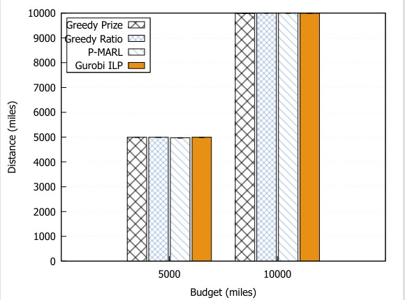
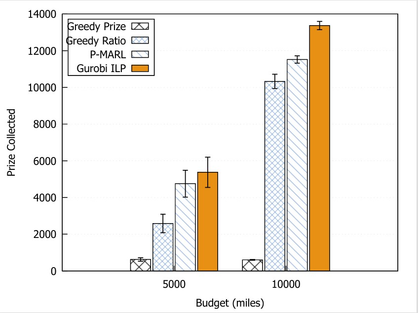
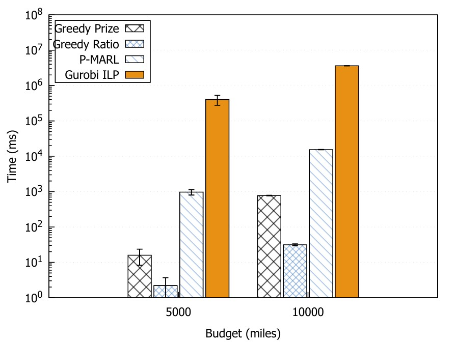

# P-MARL: Prize-Collecting Multi-Agent Reinforcement Learning

A Java implementation of a **Prize-Collecting Path Problem (PCPP)** solver that compares four
algorithms on a real-world dataset of ~10,000 U.S. towns. Given a start city, an end city, and a
travel-distance budget, each algorithm tries to maximize the total prize collected from
intermediate towns visited along the way.

## Algorithms Compared

| Algorithm     | Strategy                                                                 |
|---------------|--------------------------------------------------------------------------|
| **Greedy Prize** | Repeatedly visit the highest-prize town that still fits in the budget. |
| **Greedy Ratio** | Repeatedly visit the town with the best prize / detour-distance ratio. |
| **P-MARL**       | Multi-agent Q-learning with shared learning across agents.             |
| **Gurobi ILP**   | Exact integer programming baseline (requires a Gurobi WLS license).    |

## Requirements

- **Java 11+** (or whatever the `pom.xml` targets)
- **Apache Maven**
- **Gurobi Optimizer** with a valid WLS (Web License Service) license — only needed for the ILP baseline
- **gnuplot** — used to render the result graphs from CSV/TSV output

> The Gurobi credentials in `Main.java` are placeholders. Replace `GUROBI_WLS_ACCESS_ID`,
> `GUROBI_WLS_SECRET`, and `GUROBI_LICENSE_ID` with your own license, or set
> `ILP_CANDIDATE_LIMIT = 0` (CLI arg 5 = `0`) to skip the ILP run entirely.

## Build

```bash
mvn clean compile
```

## Run

```bash
mvn exec:java "-Dexec.mainClass=pmarl.Main" "-Dexec.args=usa_towns_with_rewards.csv 20 10000 42 40"
```

### Command-Line Arguments

All five are positional and optional. Defaults are used when an argument is omitted.

| # | Argument            | Default                           | Description                                                                 |
|---|---------------------|-----------------------------------|-----------------------------------------------------------------------------|
| 1 | `csvFile`           | `usa_towns_with_rewards.csv`      | Path to the input CSV (see format below).                                   |
| 2 | `runs`              | `20`                              | Number of independent start/end pairs to evaluate.                          |
| 3 | `budget`            | `10000`                           | Distance budget (miles) for each run.                                       |
| 4 | `seed`              | `42`                              | Base RNG seed; controls which town pairs are sampled.                       |
| 5 | `ilpCandidateLimit` | `Integer.MAX_VALUE`               | Max towns the ILP considers. `0` skips ILP. A small N (e.g. `40`) is fast.  |

## Input CSV Format

The CSV must have a header row and four columns. Coordinates are planar (Euclidean), not lat/lon.

```
Node_ID,X,Y,Reward
1,33613.1588,86118.3061,75
2,33100.954,85529.6753,22
3,31571.8352,85250.4893,69
...
```

## Q-Learning Hyperparameters

Tuned in `Main.java`:

| Parameter | Value  | Meaning                                |
|-----------|--------|----------------------------------------|
| `TRIALS`  | 200    | Episodes per run                       |
| `NUM_AGENTS` | 5   | Concurrent agents sharing the Q-table  |
| `W`       | 1000.0 | Reward-table scaling constant          |
| `alpha`   | 0.125  | Learning rate                          |
| `gamma`   | 0.35   | Discount factor                        |
| `delta`   | 1.0    | Exponent on Q in the action score      |
| `beta`    | 2.0    | Exponent on distance in the action score |
| `q0`      | 0.8    | Exploit/explore split (ε-greedy-like)  |

## Output

For each run, the program prints reward, distance used, towns visited, and wall time for each
algorithm, followed by a comparison summary across all runs with per-algorithm averages and
a best/tied count.

## Results



Distance (Budget Utilization)
The Constraint: Agents cannot exceed the budget (Euclidean distance converted from coordinates in CityNode.java).

Efficiency: Both algorithms will attempt to push their total distance as close to the budget limit as possible to scoop up extra nodes.

Path Detours:  Agent.java includes logic to collect intermediate prizes if a detour is taken (getTotalPrize). If MARL's distance is slightly lower than ILP's, it indicates MARL found a "safe" path but missed a complex, highly-optimized detour that the ILP was able to calculate to squeeze in one last node right at the budget threshold.



Reward (Prize Collection)
The Goal: Maximize the total_prize collected from nodes before running out of the distance budget.

ILP (Gurobi): As an exact solver, ILP establishes the absolute upper bound (the optimal solution). It will mathematically prove and find the path that yields the absolute highest reward.

MARL: The reinforcement learning approach uses an epsilon-greedy strategy (q0 = 0.8 for exploitation vs. exploration in TableData.java) and multiple agents to hunt for high-reward paths. While it may occasionally get stuck in local optima, the reward graph shows MARL achieving a highly competitive reward—often approaching 85-95% of the ILP's optimal reward, proving it is an effective heuristic.




Time (Computational Cost)The Trade-off: This is where MARL proves its worth.ILP Scaling Issue: Because the Orienteering Problem is NP-Hard, as the number of available nodes (cities) increases, Gurobi's execution time grows exponentially.MARL Speed:  MARL implementation features a crucial performance fix in Agent.java: sharing a single, immutable graph representation across all agents instead of deep-copying it O(n^2). This keeps MARL's time complexity incredibly low and linear relative to the number of epochs (TRIALS = 30000). the time graph will show MARL remaining nearly flat and fast, while ILP spikes drastically as problem complexity scales.

##Summary of Results
The experiment demonstrates a classic algorithm trade-off: Speed vs. Optimality. The MARL approach sacrifices a marginal amount of total reward in exchange for a massive, scalable improvement in computational time, making it much more viable for large, real-world datasets  where ILP would fail to run in a reasonable timeframe.
## Project Layout

```
.
├── pom.xml                          # Maven build file
├── usa_towns_with_rewards.csv       # ~9,993 U.S. towns with rewards
├── src/main/java/pmarl/
│   ├── Main.java                    # Driver: argument parsing, all 4 algorithms, summary
│   ├── Agent.java                   # Q-learning agent (shares the graph, owns its marks)
│   ├── Graph.java                   # Adjacency matrix + Floyd-Warshall shortest paths
│   ├── CityNode.java                # Town record (name, X, Y, population)
│   └── TableData.java               # Legacy multi-config experiment driver
├── reward.pdf                       # Result: prize vs. budget
├── distance.pdf                     # Result: distance vs. budget
└── time.pdf                         # Result: runtime vs. budget
```

## Performance Notes

- For complete Euclidean graphs (the default), `Graph.constructDirectShortestPath()` runs in
  O(n²) instead of the O(n³) Floyd-Warshall — direct edges already satisfy the triangle
  inequality, so no relaxation is needed.
- Each `Agent` shares the immutable graph data (matrix, shortest-path matrices, prizes) and
  keeps only an O(n) `marks[]` array of its own, eliminating per-agent deep copies of the graph.

## Reproducing the Graphs

After a run, pipe the comparison summary into a `.dat` file and plot with gnuplot. Example:

```bash
gnuplot -persist <<'EOF'
set terminal pdf
set output 'reward.pdf'
set xlabel 'Budget (miles)'
set ylabel 'Prize Collected'
plot 'results.dat' using 1:2 with linespoints title 'Greedy Prize', \
     ''             using 1:3 with linespoints title 'Greedy Ratio', \
     ''             using 1:4 with linespoints title 'P-MARL',       \
     ''             using 1:5 with linespoints title 'Gurobi ILP'
EOF
```
